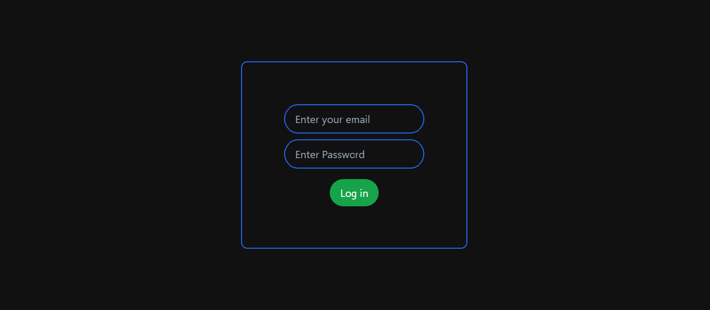
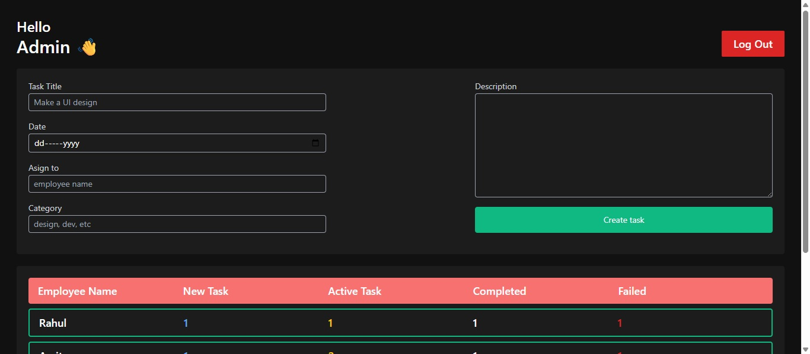
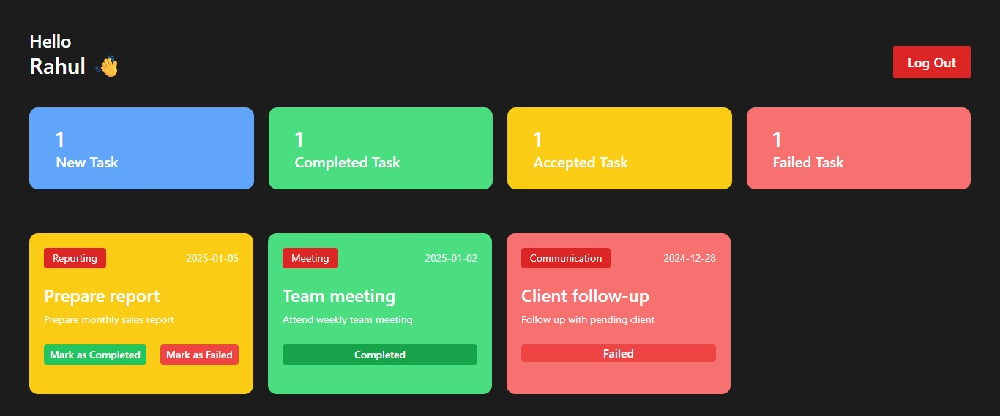

# 🏢 Employee Management System

A simple and efficient Employee Management System built using **React + Vite + Tailwind CSS**.  
This system helps track employee tasks such as *new tasks, accepted tasks, completed tasks, and failed tasks*.

---

## 🚀 Features

### 👨‍💼 Admin Features
- Admin login
- Create new tasks for employees
- Assign tasks to any employee
- Auto update employee task counts (new, active, completed, failed)

### 👩‍🏭 Employee Features
- Employee login
- View assigned tasks
- Accept task
- Mark task as Completed
- Mark task as Failed
- Live task status updates

### 📦 Other Features
- LocalStorage-based persistent data
- Context API for global state management
- Clean UI using Tailwind CSS
- Fully responsive layout

---

## 📁 Project Structure

```
EMS/
├── public/
├── src/
│   ├── components/
|   |   ├──Auth/
|   |   |  └── Login.jsx
|   |   ├──Dashboard/
|   |   |  ├── AdminDashboard.jsx
|   |   |  └── EmployeeDashboard.jsx
|   |   ├──other/
|   |   |  ├── AllTask.jsx
|   |   |  ├── CreateTask.jsx
|   |   |  ├── Header.jsx
|   |   |  └── TaskListNumbers.jsx
|   |   ├──TaskList/
|   |   |  ├── AcceptTask.jsx
|   |   |  ├── CompleteTask.jsx
|   |   |  ├── FailedTask.jsx
|   |   |  ├── NewTask.jsx
|   |   |  └── TaskList.jsx
│   ├── context/
|   |   └── AuthProvider.jsx
│   ├── utils/
|   |   └── localStorage.jsx
│   └── App.jsx
├── .gitignore
├── package.json
├── tailwind.config.js
├── vite.config.js
└── README.md
```

---

## 🛠️ Tech Stack

- **React.js**
- **Vite**
- **Tailwind CSS**
- **Context API**
- **LocalStorage**
- **JavaScript (ES6+)**

---

## 🔧 Installation & Setup

Follow these steps to run the project locally:

### 1️⃣ Clone the repository
```bash
git clone https://github.com/vasukurdia/Employee-Management-System.git
```

### 2️⃣ Navigate into project folder
```bash
cd Employee-Management-System
```

### 3️⃣ Install dependencies
```bash
npm install
```

### 4️⃣ Start development server
```bash
npm run dev
```

Project will run at:
```
http://localhost:5173/
```

---

## 🔐 Login Credentials

### **Admin Login**
```
email: admin@me.com
password: 123
```

### **Sample Employee Login**
```
email: employee1@example.com
password: 123

email: employee2@example.com
password: 123
```

---

## 📸 Screenshots  

### 🔹 Login Page  


### 🔹 Admin Dashboard  


### 🔹 Employee Dashboard  


---

## 🤝 Contributing
Pull requests are welcome. For major changes, please open an issue first.

---

## 📄 License
This project is **open-source** and free to use.

---

# 🎉 Author
**Vasu Kurdia**  
Made with ❤️ in React

---
